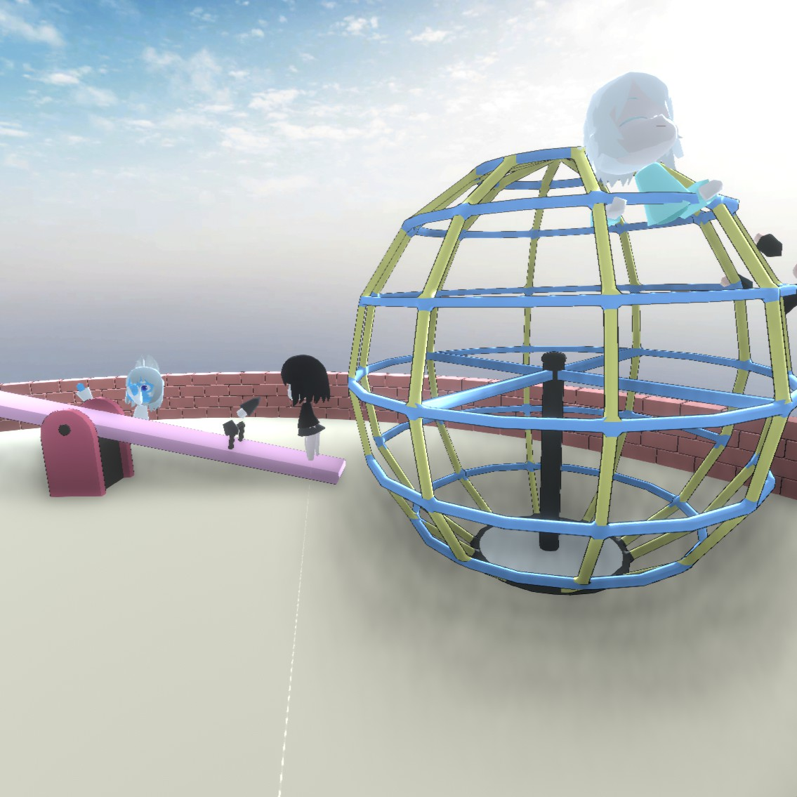
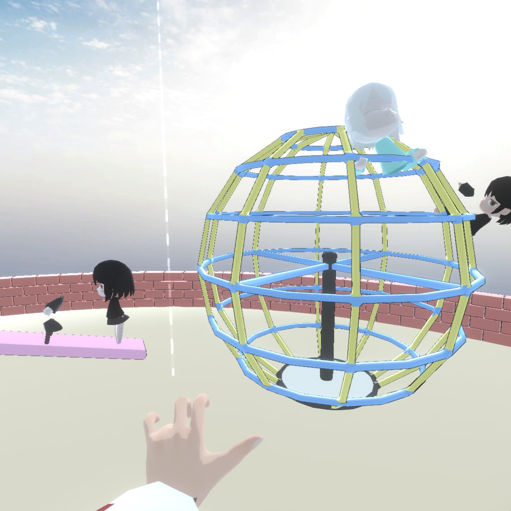

# Neos Without SSAO

A [MelonLoader](https://melonwiki.xyz/)-based mod for [NeosVR](https://neos.com/) to
disable the game's awful Screen-space Ambient Occlusion (SSAO) post-processing effect, and also toggles all of unity post processing to get rid of the awfully high bloom settings.

## Notice

As usual, modifying NeosVR in this fashion violates the [NeosVR EULA](https://store.steampowered.com/eula/740250_eula_0), and this mod is offered with no warranty, etc, etc.

Vote on the [official NeosVR bug for configurable post processing effects](https://github.com/Neos-Metaverse/NeosPublic/issues/322) and let the team know in [their new user survey](https://docs.google.com/forms/d/e/1FAIpQLSdp3nFz9Wt6o27S7jsJOukfzMv9dFjyrSfHrTgXiBAvmABzwg/viewform) that turning off SSAO should be an officially supported feature.

## How to use

1. Follow the [MelonLoader instructions](https://melonwiki.xyz/#/README) to install it for Neos.exe
2. Clone this repository and build it with Visual Studio
3. Go fish out `NeosWithoutSsao.ddl` in the build directory and copy it into the `Mods/` dir by Neos.exe.
4. Launch the game. By default both SSAO and post processing are disabled.
5. Press F9 to toggle post processing and F10 to toggle SSAO.

If you have trouble with Neos freezing on boot, try the `--quitfix` command line option.

## Screenshots

Neos default:

SSAO disabled:

